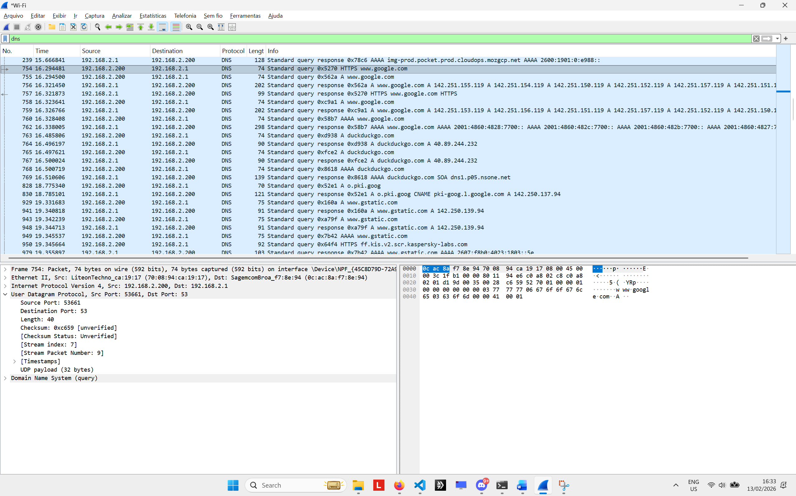
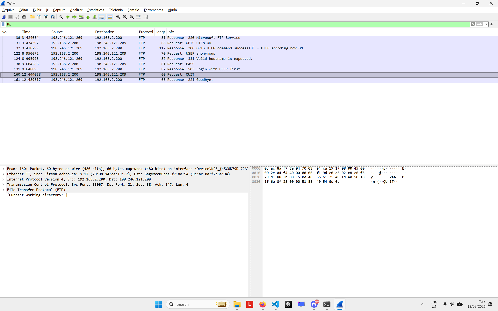

# CPAN226 Lab 3: Using Wireshark to Examine DNS and FTP Protocols

**Student:** Gustavo Guidini Salerno / N01648740
**Course:** CPAN226 - Networking & Telecommunications
**Date:** February 13, 2026

---

## Lab Overview

This lab examines DNS and FTP protocols using Wireshark. DNS queries use UDP to translate domain names to IP addresses, while FTP uses TCP to transfer files between network devices.

**Tools Used:**
- Wireshark
- Command Prompt (ipconfig, ftp, nslookup)

---

## Section A: DNS

### Q1: Table 1 - Local PC Configuration

| Item | Details | Source |
|------|---------|--------|
| IP Address | 192.168.2.200 | ipconfig /all |
| MAC Address | 70-08-94-CA-19-17 | ipconfig /all |
| Default Gateway IP Address | 192.168.2.1 | ipconfig /all |
| DNS Server IP Address | 192.168.2.1 / 207.164.234.193 | ipconfig /all |

---

### DNS Capture Screenshot

---

### Q2: Source MAC Address

The source MAC address is 70:08:94:ca:19:17 (LiteonTechno_ca:19:17). Yes, it is the same as the Physical Address recorded in Part 1 Table 1 for the local PC. This is expected because the DNS query originates from this machine.

### Q3: Table 2 - Device Mapping

| Device | IP Address | MAC Address |
|--------|-----------|-------------|
| Source (Local PC) | 192.168.2.200 | 70:08:94:ca:19:17 |
| Destination (Default Gateway) | 192.168.2.1 | 0c:ac:8a:f7:8e:94 |

### Q4: Table 3 - UDP Segment Analysis

| Field | Captured Value | Source |
|-------|---------------|--------|
| Source IP Address | 192.168.2.200 | Wireshark - IP layer |
| Destination IP Address | 192.168.2.1 | Wireshark - IP layer |
| Source Port | 53661 | Wireshark - UDP layer |
| Destination Port | 53 | Wireshark - UDP layer |
| UDP Payload Length | 32 bytes | Wireshark - UDP layer |
| UDP Header Length | 8 bytes | Wireshark - UDP layer |

### Q5: Source IP Verification

Yes, the source IP address (192.168.2.200) is the same as the local PC's IP address recorded in Part 1.

### Q6: Destination IP Verification

Yes, the destination IP address (192.168.2.1) is the same as the default gateway and DNS server noted in Part 1. The router acts as both the default gateway and the DNS forwarder.

### Q7: DNS Response - Ethernet II Frame

In the DNS response, the source MAC address is from the default gateway/router (SagemcomBroa - 0c:ac:8a:f7:8e:94) and the destination MAC address is from the local PC (LiteonTechno - 70:08:94:ca:19:17). The addresses are reversed compared to the query because the response travels in the opposite direction, the router is now sending data back to the PC.

### Q8: DNS Response - IP Addresses

The source IP address is 192.168.2.1 (the DNS server/router) and the destination IP address is 192.168.2.200 (the local PC). These are also reversed compared to the query, since this is the response packet.

### Q9: Resolved IP Addresses for www.google.com

The DNS server returned 8 IPv4 addresses for www.google.com (from the A record response):
- 142.251.155.119
- 142.251.154.119
- 142.251.150.119
- 142.251.152.119
- 142.251.157.119
- 142.251.151.119
- 142.251.156.119
- 142.251.153.119

Google uses multiple IP addresses for load balancing and redundancy across its global server infrastructure.

---

## Section B: FTP

### FTP Capture Screenshot

---

### Q10: Table 4 - FTP Transport Analysis

| Field | Captured Value | Source |
|-------|---------------|--------|
| Transport Protocol | TCP | Wireshark - Transport layer |
| Source Port | 35067 | Wireshark - TCP layer |
| Destination Port | 21 | Wireshark - TCP layer |
| Sequence Number | 38 | Wireshark - TCP layer |
| Acknowledgement Number | 147 | Wireshark - TCP layer |
| TCP Payload Size | 6 bytes | Wireshark - TCP layer |

### Q11: Acknowledgement Number

The Acknowledgement Number indicates the next byte the receiver expects from the sender. It is calculated by adding the sender's sequence number to the length of the data received. An Acknowledgement Number of 147 means the PC has successfully received all bytes from the server up to byte 146, and is now expecting byte 147 next. This mechanism allows TCP to maintain reliable, ordered delivery, both sides keep track of exactly which bytes have been sent and received, enabling retransmission of any missing data.

---

## Reflection Questions

### R1: Benefits of using UDP instead of TCP for DNS (7 pts)

UDP doesn't need a connection setup like TCP does, so there's no three-way handshake slowing things down. The headers are way smaller too, only 8 bytes compared to 20+ bytes for TCP, so there's less overhead. UDP also doesn't bother with acknowledgements or retransmissions, which makes it faster. DNS queries are just a quick question and answer, so if a response gets lost, the PC can just ask again. For simple lookups like DNS, speed matters more than guaranteed delivery.

### R2: Differences between UDP and TCP (7 pts)

TCP is connection-oriented, meaning it sets up a connection first using a three-way handshake (SYN, SYN-ACK, ACK) before sending any data. UDP is connectionless and just sends data right away without any setup. TCP guarantees that data arrives correctly and in order using sequence numbers and acknowledgement numbers, if something gets lost, it retransmits it. UDP doesn't guarantee any of that, so packets can get lost or arrive out of order. TCP headers are bigger (20+ bytes) because they carry all those tracking fields, while UDP headers are only 8 bytes with just the source port, destination port, length, and checksum. So TCP is better for things that need reliability like FTP and HTTP, and UDP is better for things that need speed like DNS and streaming.

### R3: Connection-oriented vs Connectionless protocols (6 pts)

Connection-oriented protocols like TCP set up a session between the sender and receiver before any data gets transferred. They do a handshake first to make sure both sides are ready, and then keep track of everything during the exchange, delivery, ordering, and flow control. When they're done, the connection gets formally closed.

Connectionless protocols like UDP don't set up any session. Each packet gets sent on its own with no arrangement between sender and receiver. There's no guarantee that packets arrive, arrive in order, or don't get duplicated. This makes connectionless protocols faster and lighter, but less reliable. It depends on what the application needs, reliability goes with connection-oriented, speed goes with connectionless.
